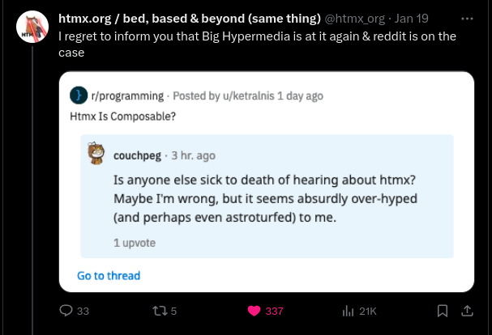
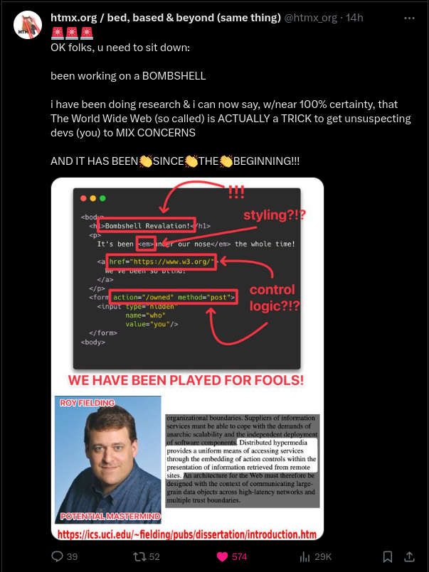

# Why I'm switching to AlpineJs

If you haven't built a **HDA** (Hypermedia-Driven Application), you should at leat try it. It has helped me build an entire production app ([ioigntion](https://ioignition.com/)) on my own. AplineJs was the missing piece in the puzzle.

This article is more Scripting focused, and assumes you are aware of Hypermedia-Driven Applications and HTMX. If not the [HTMX Website](https://htmx.org/) and the [Hypermedia Systems book](https://hypermedia.systems/) is a great place to start. No I'm not sponsored by them.

This is not the next big hype, despite what Reddit thinks.

Now that, that's out of the way. Let's dive in.

## Scripts are painful

Can't be just me. Adding `<script>`, is just painful. How many times have you looked at an interaction and wondered, "where is that defined?" While writing HDA's, this part quite unappealing. It's painful to write, maintain, and can cause side effects that are quite gnarly to debug. Even on smaller projects.

The book does suggest [rsjs](https://ricostacruz.com/rsjs/), which provides guidelines to help reduce a lot of the pain. Still wasn't the right solution for me and you'll see why.

## Locality of Behavior (LoB)

>The behavior of a unit of code should be as obvious as possible by looking only at that unit of code.
> https://htmx.org/essays/locality-of-behaviour/

LoB, is a software design principle coined by the htmx team. Not to offend the creators, but it's not that revolutionary. Moment you start writing HDA's, it's the first thing you notice. The HTML sent over the wire by your server, has all the info it needs to represent the information and include control logic (this is where HTMX makes a big difference).

Scripts break this concept. As their effects are not local or obvious. Especially true if you have a single script that defines interaction for two similar elements. So, back to SPA? Nothing that crazy, there are saner options.
## Solution: Hyperscript or AlpineJs

This was the missing piece in my Hypermedia transformation. I wasn't sure if there was a solution to this, or where to even look for one. Luckily, I did not have to look far. Whole section in the hypermedia systems is dedicated to scripting in hypermedia. 

One of the options was mentioned above (rsjs). I wanted something that would be have a more similar syntax and locality of behavior as hypermedia. The other two suggestions in the book were:

[Hyperscript](https://hyperscript.org/) is made by the same team that created htmx. It solves the problems stated above. Although, it's not my choice of adding interactivity to HTML. Nothing wrong with Hyperscript, it's just that I find it a bit verbose. Which is just my personal opinion and should not deter you from trying it out.

[AlpineJs](https://alpinejs.dev/), is what I've decided to use for my scripting needs. It's simple, very much hypermedia like. There are also a set of pre-defined components, which I find very useful to understand the patterns. Again, this is just what I prefer, in terms of syntax and style.

## Finally

If you use htmx and have been finding `<script>` tags making a mess of your code and keeping you awake at night, you may find these useful. I do have to say that, I'm very new to the whole Hypermedia-Driven Application philosophy. So I urge you to try it out and not to take my word for it.

I realized the problem as I was working on my first htmx production app, the solution was entirely provided by the hypermedia systems book. Which is a must read. I even wrote a short summary of it. You can find it [here](https://www.seagin.me/2024/book-summary-hypermedia). Hope this was remotely useful to at least one person.
