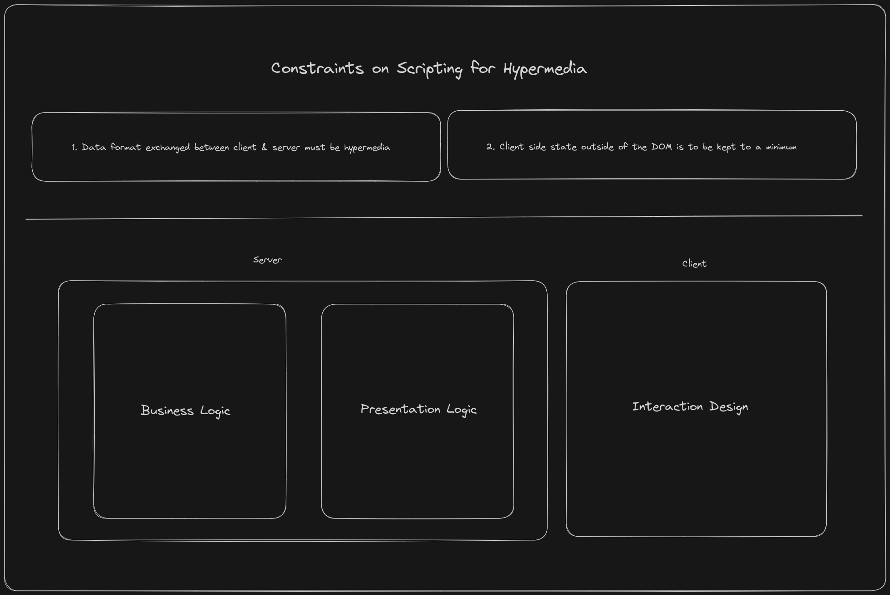

# Final Thoughts on Hypermedia Systems Book

**TLDR**; The book is amazing, go read it. It will change your perspective on web programming for the better

Took me about four days of reading, but I've read the final section I needed to read to get the answers I was looking for. Why I picked up the book? I needed answers to some of these, if not all:

* How were applications built before SPAs came along?
* Why were they built the way they were?
* Is there a better way to deal with Scripts when using HTMX?
* How to make changes to other elements from the current one?
* Why does my UI break when after closing I hit `ctrl + shift + t`? (Try to reopen last close tab)

You might be wondering, "you could have just googled these questions". Which is what I would have normally done. Why read a whole book? Reason being, I like to have a deeper understanding of the tools I use. I have realized that, building something complete with it first and then reading on it helps me understand the concepts better. I built [the app](https://ioignition.com/), now it was time to read up.

These were some of the questions that came up as I was building my first ever production HTMX app. Throughout the whole process of building the app, I felt that I'm missing key concepts. This was expected, as I had only built Single Page Applications before.

## Learning about Scripting Responsibilities

It was quite clear to me that the business logic was defined in the server. I has always thought, Representation was the responsibility of the client and so was the interaction design. Going through the book helped me understand why it's easier and better that the server be the source for presentation logic, as the server is the single source of truth, you can avoid the pain of having to duplicate server state on the client. 

There are exceptions to this of course, like an excel sheet application mentioned in the book. Although, reading through the book I've come to understand that Hypermedia is capable a lot more, that it gets credit for. 

## Client Side Scripting

While building the HTMX application, the whole time I kept wondering, are `Script` tags the best way to handle interactions on a web page? Going through the book I realized, they can be a lot better by following [certain guidelines](https://ricostacruz.com/rsjs/). Although, what made me most excited was finding out about [AlpineJs](https://alpinejs.dev/) in the book. This is exactly what I was looking for! After understanding, the power of hypermedia, having to write `Script`s to make some interactions work, just felt clunky. But having read thought the AlpineJs docs, it felt like there was a consistency in the representation and interaction code. 

[Hyperscript](https://hyperscript.org/) is a great alternative as well, it's only personal preference that I like the syntax of AlpineJs better. But I found both to be great alternatives over writing scripts as the code works and feels more consistent with the rest of the Hypermedia Driven Application design.

## Finally

I'm glad I read the book, I have a better understanding of Hypermedia, and more importantly how to build Hypermedia Driven Applications. Having, just built my first production ready app with HTMX, helped a lot.

The book is excellent, it helped me understand key concepts that I had never known or heard since the start of my programming career (2019). I have a much clearer understanding of Hypermedia, it's constraints and why they exist. Also, I feel better equipped to solve problems by leaning on the browser and the tools it provides.

The last couple of years working as a Frontend developer, I've kept wondering if React is truly the best way to build web applications. It felt like, there was so much code to be written, and so many things to keep track of, errors, accessibility, state, interactions, etc. It felt like you needed a team of developers to build the simplest of web apps. Using HTMX and then reading the book helped me realize that a single developer can build complex applications through Hypermedia & the powerful Hypermedia client (the browser).

## Final Finally

I've left the sections from JSON Data APIs & Hypermedia-Driven Applications unread. I will read the rest of the book in the future when I need to write API's or bring Hypermedia to mobile.
