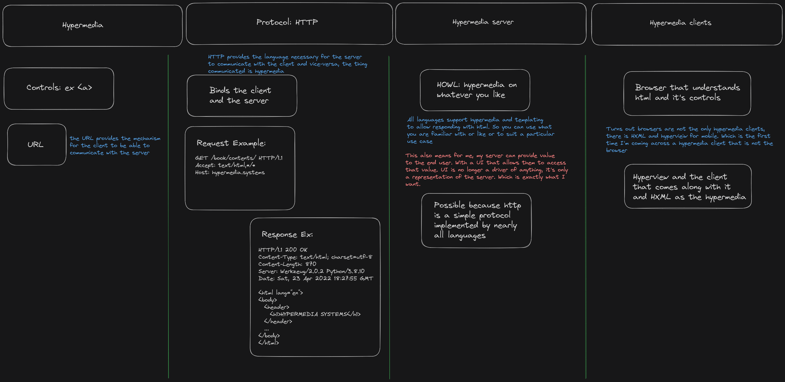

# Components of a Hypermedia System

There are four main components to a hypermedia system: hypermedia, protocol, server and client.

## Hypermedia

At first I was sure there's only one form of hypermedia, i.e. `HTML`, turns out I was quite wrong. There's something called `HXML`, which I'm not sure what it is exactly other than, it is the hypermedia for the hyperview. Which is a mobile based hypermedia. That's my best rudimentary understanding of it so far any way.

## Protocol

This the mode through which communication happens with the server and the client. It's a certain set of understanding that the client and the server share. So each time a a client talks to a server it lets the server know what to expect in what form, and to which server. The server accordingly responds with a certain set of instructions for the client and how to process what it has received, if it has moved, updated, can be cached, how long it can be cached for, etc, etc. The protocol, we are talking about is `HTTP`.

## Server

This is a piece of software written in any language that can understand an `HTTP` response and can provide an `HTTP` response that comes with hypermedia that the client can then use to display the server state.

## Client

I was pleasantly surprised here, I was so sure that the browser would be the only hypermedia client. Turns out, it's not the case. There exists, hyperview. Which takes `HXML` from the server instead of `HTML` to show information on a mobile device. Quite cool. So on my server, I could depending on the source of the request return `HTML` or `HXML`. This is really cool!

## Takeaway

One of the main takeaways for me, is the fact that a single developer can be a lot more productive. You no longer work in a silo, where you are responsible for one very specific thing, not being aware of the various aspects of the whole. Whereas by embracing hypermedia, you know what it is that needs to reach the end user and you build your system with that in mind, create your responses to what appears on screen. Rather than, creating response for another developer. 

This might not be very exciting to a lot of people, but as a indie hacker, this is amazing. It should be exciting to a lot of organizations out there. Imagine if a single developer can build an entire system, what could a team of such empowered individuals build.

Finding out about, hyperview has given me some ideas too. Based on the hypermedia client that requested the resource, you could respond with `HTML` or `HXML` meaning  the server can drive an application running anywhere. This is really exciting. The more I read into the book, the more I'm convinced of this path.
