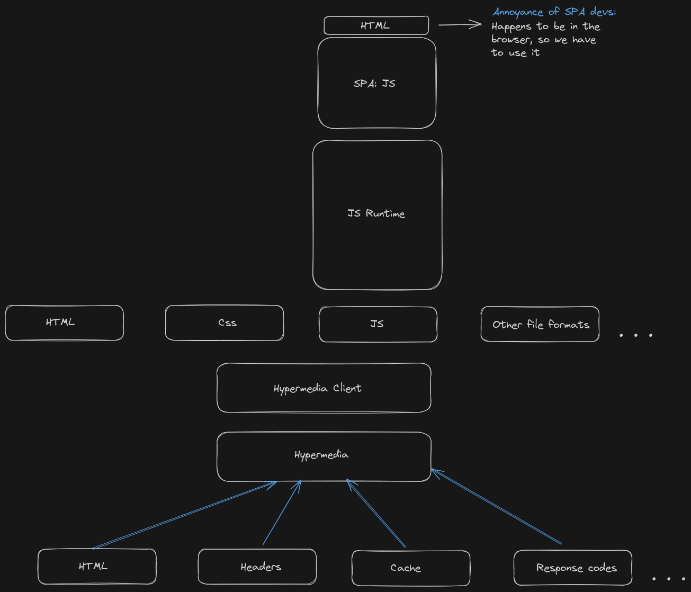
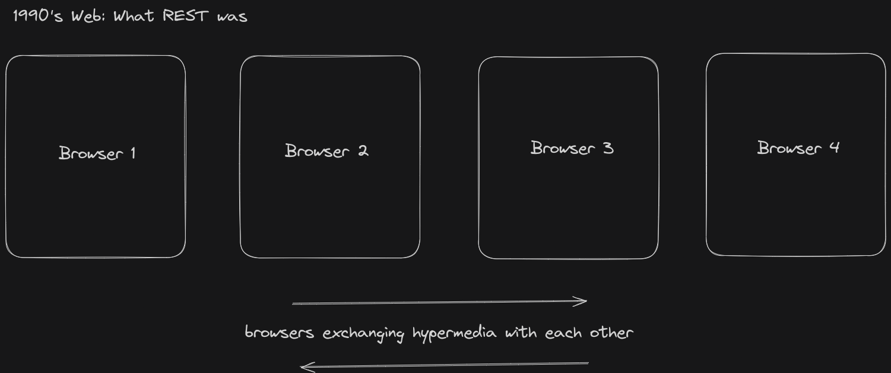
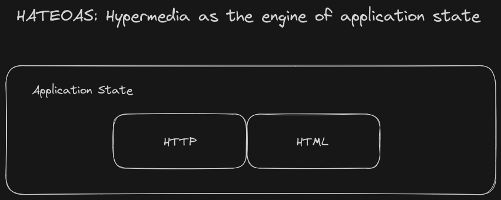

# Web 1.0, it's not archaic, I was ignorant

Reading through the first few pages of the book, I was astonished at how little I know about the early web. How I really had no idea of what `REST` actually meant. I considered myself to be quite aware of a lot of things, but this was a rude awakening to the contrary. It might sound like I am disheartened, quite the contrary. I am glad, I decided to finally sit down and read through the history of hypermedia. I feel empowered, all these years of writing SPA's and wondering, why does it need to so complicated and error prone? I thought it was just a skill issue, especially with the internet seeming so confident with everything. This was a relief. 

## Components that make up hypermedia

This was interesting, understanding what comprises a hypermedia system. How there is so much more to hypermedia than `HTML`. Understanding, why I was annoyed of `HTML`, because when developing web apps the `SPA` way, it gets in the way. You have this tool in the form of JavaScript, which you rely on so much that it seems like, if only `HTML` were better, then my life would be easier, or better yet if I did not have to bother about this clunky tool called `HTML`, which seemed archaic compared to what JavaScript was capable of.

## REST: It is not what I thought it was!

When I thought of `REST`, my mind went to `API`'s that returned `JSON` objects, in fact the word `API` is almost used together with `REST`.  **RE**presentational **S**tate **T**ransfer turns out was meant as a network architecture. It also, turns out that in the 90's it was meant as a way for browsers to exchange hypermedia.

## HATEOAS

Client side state management is hard, why is it though? Simple, we have a source of truth, the server. Trying to make the client reflect this truth, is not easy. There is a simpler approach, just don't. Use `HTTP` to send you the representation of this truth in the form of `HTML`. This was one of the first benefits I noticed as I was building [ioignition](https://ioignition.com/), not having to maintain any state on the client, is so much more easier. 

