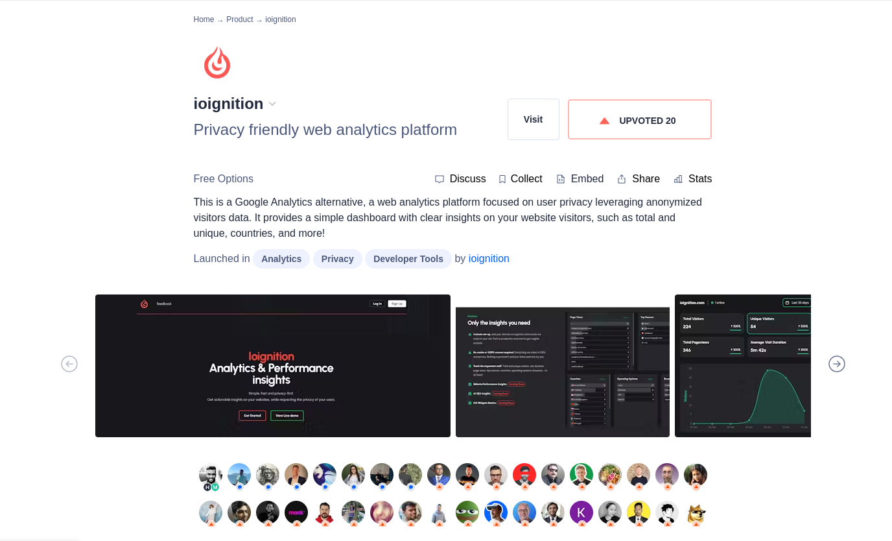

# 3 key lessons learned from launching my second project on product hunt

Here are the 5 key lessons learned from launching [ioignition](https://www.producthunt.com/posts/ioignition) on product hunt. This was my second ever project released.

Recently, me and my friend decided to take on the 12 projects challenge, where we build an idea every month. These are some interesting things I've observed from building ioignition. You might find it useful, if you want to build your own projects, but not sure where to start from. 

Let's dive in.

## 1. You first few project will most likely suck, so don't overthink it, build it, then ship it

Getting started is the hardest part, I had to remind myself of the above often. As I often found myself over engineering or over thinking things. Having a deadline (30 days), helped. Also, what helped was that understanding, is a slightly polished proof of concept.

> "The journey of a thousand miles must begin with a single step." -Chinese Proverb

Our first product [translateaudio](http://translateaudio.co/) was a crash and burn. But what it did teach us, was that how to setup a server, automate builds, really really quickly. It taught us, about the technology we used, and why we had to pick another set of tool (we switched from Nodejs to Go). 

Most importantly though, we completed it. We had a finished product, which is the habit I am trying to build. That and learning to talk about and sell the product.

## 2. Pick the tools that you are most comfortable with

This one is really important. For the first project I picked [Nodejs](https://nodejs.org/en). This was a mistake, the only reason I picked it was because I thought that most indiehackers and startups use it, so must be a fast tool to iterate on. I was wrong, Nodejs is not the tool for me.

> "Anything you can do needs to be done, so pick up the tool of your choice and get started."
	- Ben Linder

The next project was built with Golang and Postgres. This might have seemed like overfill, but I was familiar with both these tools. I was able to work on the project from day 1, the setup took hardly any time. Plus, I enjoy writing Go, that was a bonus.

## 3. Follow your curiosity

As I was setting up analytics for the first project and my own blog, I was curious about how it worked and wondered, If I could build one on my own. 

> "We keep moving forward, opening up new doors and doing new things, because we're curious... and curiosity keeps leading us down new paths."
	- Walt Disney

Compared to the first project, I found myself willing to spend a lot more hours on the analytics app. I would go to bed wondering, how I would solve a particular problem, it was exhilarating. Then, once I woke up, I would make myself a coffee and head straight to the desk. I had to force myself to stop, I was obsessed with seeing it through.

This is an advantage, I intend to tap more into. The more I'm interested, the more I'm willing to endure to see the idea through.

## Finally

These are not groundbreaking discoveries, and you don't need to be doing groundbreaking things from the start. Set yourself up for success by keeping it simple, and doing things that give you energy and the drive to keep going. I hope that you are able to take that first step towards your goals. 

I'm very early in my own journey to build tools that others might find useful and financial independence. So by no means am I an expert, but just like you I am at the beginning of my journey. I believe that I can do it, and I wish the same for you.
