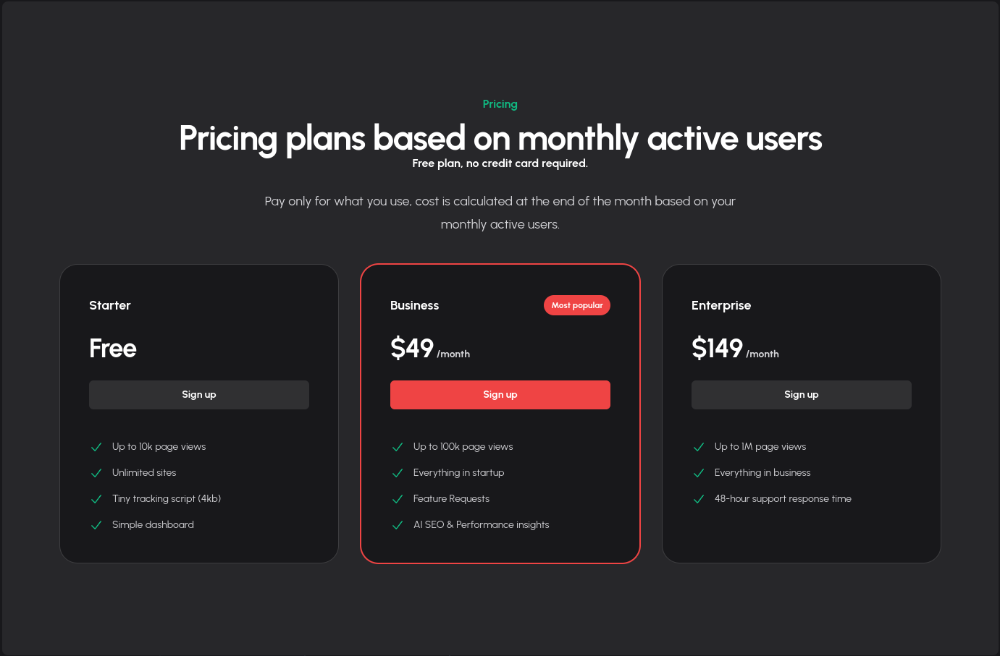

# Ioignition now has a free tier 🎉 

It seemed like quite the obvious thing to do. When deciding on the pricing, I was not sure if [ioigntion](https://ioignition.com/) should have a free tier. Eventually we have decided to have a free tier.

As a bootstrapped company ourselves, we rely on services that provide a starter tier, so that we can keep our costs low. When we do end up making money, I will have no problems paying for it.

So, it is important that we pay the same thing forward.

Also, to be candid, compared to the other players in the field ioignition is really new and in early stages. I would rather have as many people use the service as possible, which will help us improve the product in the long run.

So, if you are a bootstrapped company in your early stages, a indie developer, or a startup. Try out ioigntion for your analytics. We have some exciting features coming up.

