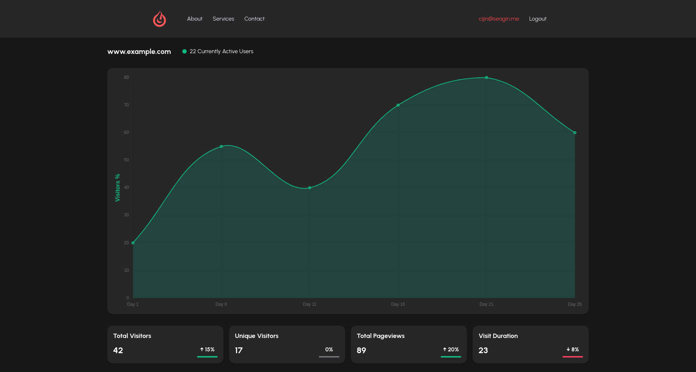

# Htmx

Ever since I tried [Htmx](https://htmx.org/), I fell in love with the simplicity 
and ease with which you can create a webpage when not using JavaScript. 

[Go](https://go.dev/) is amazing, because it comes with everything you need to write programs. 
What do I mean by this? You see, I have been a using JavaScript and Typescript for the past 4 or 5 years now for personal 
and work projects. Some of the things you do when you setup a `.js` or `.ts` project is: 
setup a bundler, transpiler, babel, formatter, testing framework. I thought 
this was just how you started projects. Sure, you can use `create-react-app` or `NextJs`, 
even then they are abstracting more or less the same things for you.

These are just some of the things you need to use, the number of choices and configs 
you need to think about is insane.

## Using Go

When I used `go` for the first time, I was shocked to see that the language can come 
with the tools you need to test, format, build the program. It's easy to read and understand 
for someone coming from `js` land. It comes with static typing, garbage collection and compared 
to `js` insanely fast build and run times. Even if it was just as fast as `js` or slightly slower 
I would still prefer a language that makes it easy for you to write code, format and build it.

I'm not here to argue why JavaScript is better or lesser than Go. Frankly, I couldn't care less. All, I 
know is that it's 10x easier to write Go than JavaScript.

## Htmx

Now, on it's own moving from Node to Go and still having to write the client in a JavaScript 
framework would still not make my life that much easier. As I could just use `NextJs` to do everything.

I've been hearing a lot about Htmx lately and I thought I'd give it a go (pun intended). My best 
understanding so far is that the browser is a lot more capable now so you could just use plain html 
to do a lot of the things that I have been using a framework for.

The weird thing was that, I had to unlearn a few things. For instance setting up protected routes 
took me a lot longer than it would have, as I hadn't used `http cookies` for handling sessions before.
Also, since I was dependant on JavaScript to handle things like setting the `Authorization` header, routing 
responses, handling form errors etc. It took me some time to think about what the browser is actually doing.
I'd say this a good thing. If anything, I'm getting a better understanding of what the browser is capable of, 
other than just executing JavaScript. Yea, shocker I know!

Creating UI and calling server methods has become significantly fast now. Especially, with the help of code gen AI tools, 
that can produce html styled with tailwindcss.

## So I don't need a Js framework anymore?

I wouldn't negate the use of framework entirely. There could be sections of your web page which might 
be easier to write with the help of a framework. So, if it gets the job done better, why not use it?

This is funny:
[Days since Javascript framework](https://js.cuvar.dev/)

## Update on the project

I've set up protected routes, some minor things need fixing (as going to login or sign-up page when logged in).
Although, there is a bit of a UI know, I've setup [Char.js](https://www.chartjs.org/), created the template. 
Now I can start adding data from the server to the template. It looks, pretty okay too.

