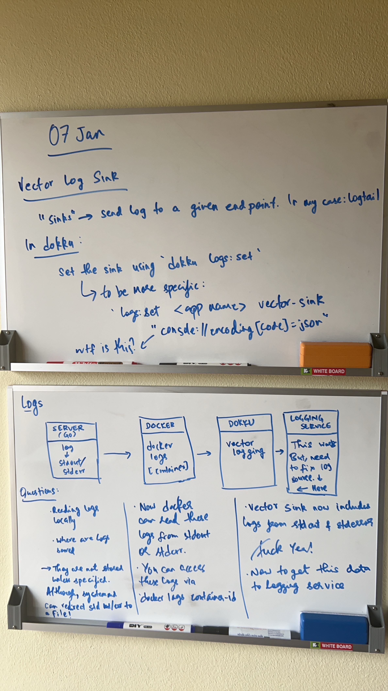

# Setting up logs with [betterstack logs](https://betterstack.com/logs) , [dokku](https://dokku.com/) & [golang](https://go.dev/)

Yesterday I had no idea how a lot of logging service worked and no mental model to follow. Today, I have a slightly better understanding, and kinda enjoyed the whole process.

My initial reactions were frustration, I could not understand why most of the logging services decided to do so much. To the point that I was half tempted to to create a service myself. Till I found out about betterstack out of pure chance. You see, I use [digitalocean](https://www.digitalocean.com/) for all my server needs. Before I go down the rabbit hole of writing a service of my own, I thought I'd just go through the digitalocean services to see if there was something there. As a last ditch effort. Luckily enough, in the add on section I found betterstack and when I saw the live tail dashboard, I was relieved as it was exactly what I needed.

Also, at the same time, one of the communities that I'm part of suggested I try [Grafana Logs](https://grafana.com/products/cloud/logs/), which would have been a great backup in case I had troubles with betterstack. Which is also a very simple solution and exactly what I needed.

## Getting the right logs

Once I had betterstack setup, I had no idea how I would do the next bit. Which was to get the `stdout` & `stderr` from the docker container running the server. This is when I came across `vector`, which is an open-source, lightweight and ultra-fast tool for building observability pipelines. Reading through the documentation I found out that vector uses "sinks" to send logs to a given endpoint, which was already configured via the betterstack quick start guide. Only thing left to do was to set the vector sink to read from the `stdout` and `stderr` of the docker container. 

Once this was done, I checked the logs locally to see if it was working and it was! For some reason I wasn't able to see the logs in the dashboard. Turned out I just had to restart the container running vector and it was done.

This was really interesting, the last couple of days I went from trying to avoiding setting logs up as I had no idea how to do it, to really enjoying it.

