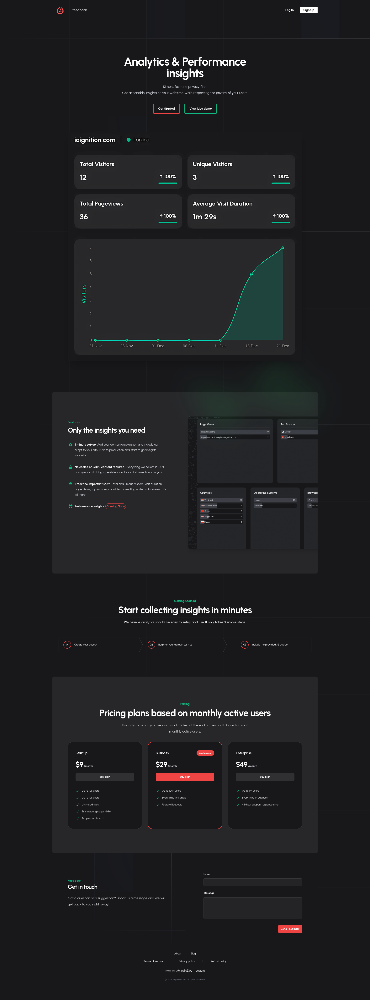

# The never ending list of todos

## Falling in love with Auth0

Me and [@mr_indie_dev](https://twitter.com/mr_indie_dev), were able to get a lot of things done on the landing page today. Fixed a few bugs with the auth flow. We use [Auth0](https://auth0.com/), which I think is just an awesome tool for managing authentication. The dashboard is amazing and the docs are just spot on. No, I'm not sponsored by them. It's just such an awesome tool that I can't stop talking about it. As a developer, I really appreciate the care taken in order to craft a tool that solves a genuine pain point. When I was about to tackle this list item, this morning, I was dreading it. But in about an hour I had the production settings ready, the UI updated to match the rest of our page, setup the social connections, and fix some minor issues along the way.
## Feeling slightly overwhelmed

At the end of the day, we were able to knock a lot of the things off the list. Moved a few things to done. This feeling was quickly squashed, as we added a just as many things as we took off to the list. These were not major things, and can be done in one solid session, but adding to the list was slightly disheartening, not gonna lie.

Just acknowledging it in this reflection has been helpful. It's hard and there are no promises, but I cannot explain how rewarding it is, to build on an idea.

## Reflecting

I have decided to write everyday. As a reflection of what was done. Even if there is not a lot of it. It was around 1900,  when we were done today. All I wanted to do was lie on the couch and do nothing, which is what I will be doing as soon as I am done with this article. Although, I am glad I decided to do this, it has helped me remember the reason I decided to go down this road. This road is not easy and is not supposed to be, but it somehow feels worth it.

This is a biased review, but I am really proud of the way the landing page has turned out.

