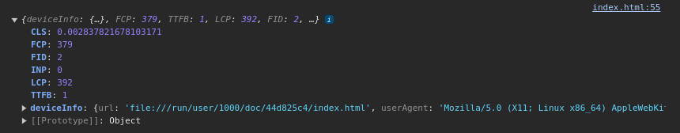
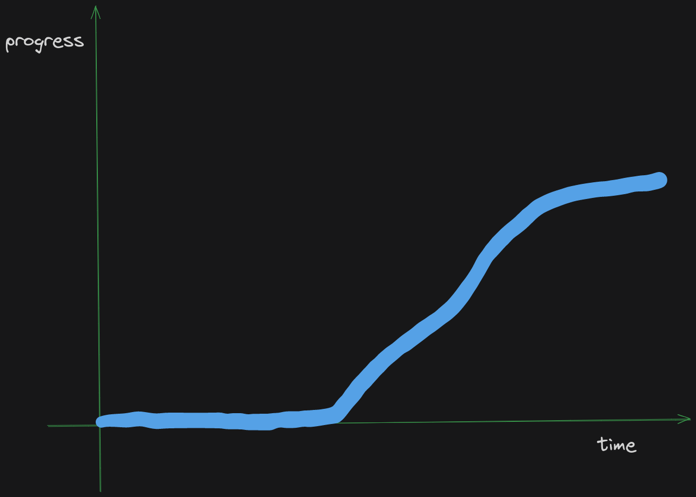

# Prototyping the next feature

Back after a short break. Went on a ride on the motorcycle on Friday. It's Monday, and I'm back at it. Last week was mostly spent fixing bugs and refining the script to be as accurate as possible. This week, I've decided to add a feature.

My usual approach is to test the idea out as simply as possible. So to test out the performance insights feature, I used an html page and wrote the script directly into it. This is my favorite feedback mechanism to test client side scripts or interactions etc.

## Deciding to use an external library

To get things started, I was going to use the [Performance Observer API](https://developer.mozilla.org/en-US/docs/Web/API/PerformanceObserver) directly, but quickly realized this would come with a few edge cases. So had a look around the internet and found [perfume.js](https://zizzamia.github.io/perfume/). Before I commit to using a external library I usually, go through the source and like to see how it works (roughly). So as I was going through the source, I noticed that the part of the library that I most needed (aggregated data on performance metrics), was handled by [web-vitals](https://github.com/GoogleChrome/web-vitals). 

Which made me curious, and I decided to check out the  `web-vitals` repository. After going through the code base, it turned out to be exactly what I needed.

## Prototyping

It took me most part of the day to go through both libraries but since I had done that, it gave me a much better understanding of the various performance API's and what I would aggregate from the browser for my MVP. 

The next part took some tinkering and going through some [web.dev](https://web.dev/) pages to come up with a strategy on aggregation. This was the fun part.

I was able to create a Proof of concept and will be going ahead with creating the required schema, cleaning up the script and probably get started on the user interface tomorrow.

This is what I have so far:

These are metrics on a html file which I'm loading from file, hence why they look suspiciously fast. Gotta love plain html.

## Key takeaway

When the day started I had a rough idea of where to begin, but nothing concrete. It usually helps me to read as much as possible to get an idea of the key concepts before starting. I've tried, getting started straight away but it takes me a lot longer. As after a while I have to come back and read what I skipped. 

This lesson was learned the hard way. After years of skipping the docs, and banging my head against the keyboard. Especially, when I have very little understanding of the feature I'm trying to build.

Making this small change has changed my experience of building things that are quite unknown. If I were to plot it on a graph, it would look something like this:

There is a period of time in the beginning when there is no progress at all. This discomfort of having no visual progress would lead me to jump straight into the implementation in the past. In the end it would end up taking a lot more time. Eventually, I decided to 
try something different as the last formula was not ideal. It took some time, but I'm a lot more comfortable progressing slowly in the first few hours or sometimes days.
