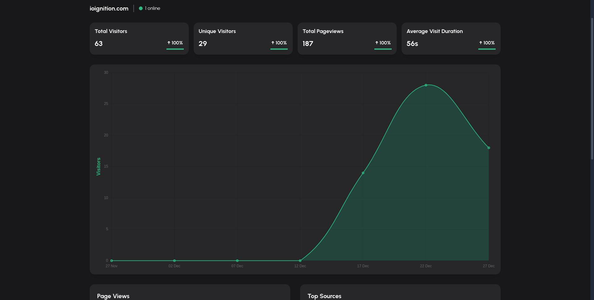
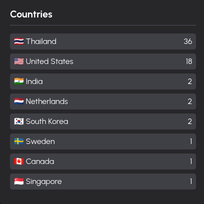
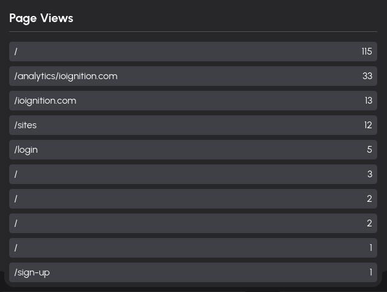

# Today was such a roller coaster. Not the good kind.

Today is one of those days, which I'm guessing most of the indie developers have gone through. It wasn't even that bad, honestly. But I think it's been building up over the 
last 40 days or so. 

I say roller coaster because, the day started out amazing. The [previous blog post](https://www.seagin.me/buildpublic/ioIgnition/limitless) that I wrote was read by actual people 
and quite a few of them too. Which has never happened before. To my surprise I went over to [ioignition](ioignition.com) and saw that people from a few places came over to see 
what it was. Now I'm not sure what they thought of it, but I was too amped to care. I even got some comments on [hacker news](https://news.ycombinator.com/item?id=38751352#38780590), which 
has never happened either.

There were some bugs that I noticed but nothing that would take too long to fix, and I was just happy to see that the site was actually recording data pretty well per visit.

### Some people came to visit

### This is where they came from

## It was downhill from there

That was the highlight of the day, from there it was pretty downhill I'd say. I started fixing the bugs, refactoring some of the things that I got feedback on. I wasn't feeling a 100%, slightly 
tired but was still able to chip away at the project. It was a slower day as I was working on things that were not that exciting.

Then it happened, I wanted to see why the page views had duplicate URL's. Jumped into my terminal, tried to re-create the problem. Pretty quickly realized that the problem was that, there was a 
trailing `#` at the end of the URL, which meant it was grouped as a unique URL by the SQL query. Not a big problem, sanitize the URL, save the host name and we are done. Created a pull request and 
I thought I was done. Not quite.

## Yea, na!

Initially, the issue was identified on the development environment, but it became apparent that on production, the home (`/`) page was being duplicated far more than necessary. 
To see why, I needed to check what was being saved in the production database. Part of the solution involved ensuring that future referrers would be stored as host names in the database. I tested an update query on the development database, and it worked flawlessly. 
The next step was to apply this fix to the production database and investigate the reason for the other duplication's. I tried a few times to log into the production database, and nothing. Not even an useful error. Definitely, a skill issue. Add it to the list.
Initially, I suspected a timeout issue, but that wasn’t the case. Tried following the troubleshooting guide for the managed database but no luck.. Despite having added my IP as a trusted source, 
I couldn't establish a connection via pgSQL. When I was checking the docs, I noticed a section to allow adding your IP to the firewall allow list, allowing my computer access, but shit just refused to connect.
After few hours of this, I caved and went to play some badminton instead. Interestingly, on the way to the court I had an idea, which I will try out tomorrow cause I have taken enough disappointment for one day.

It's not really a big deal, I know. I've been solving problems over the last 40 or so days including weekends, I think today was the first time in the last month I felt slightly exhausted. So, I've 
the problem for future Seagin. Who'll be better rested tomorrow morning, and see the problem with a fresh pair of eyes.

I still wanted to write about it because I think it's part of the journey, and this is what it's like most of the time. You are always solving problems, the lows are pretty low but the highs are just 
phenomenal. You feel like you've accomplished something. So I'll just take this on the chin and try again tomorrow. The project is getting closer to `v0.1` release, and I'm extremely proud of it.
