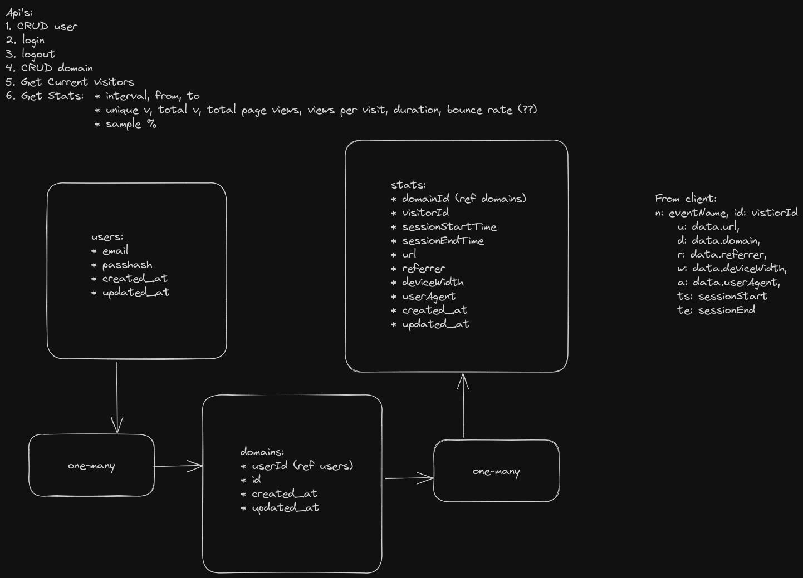
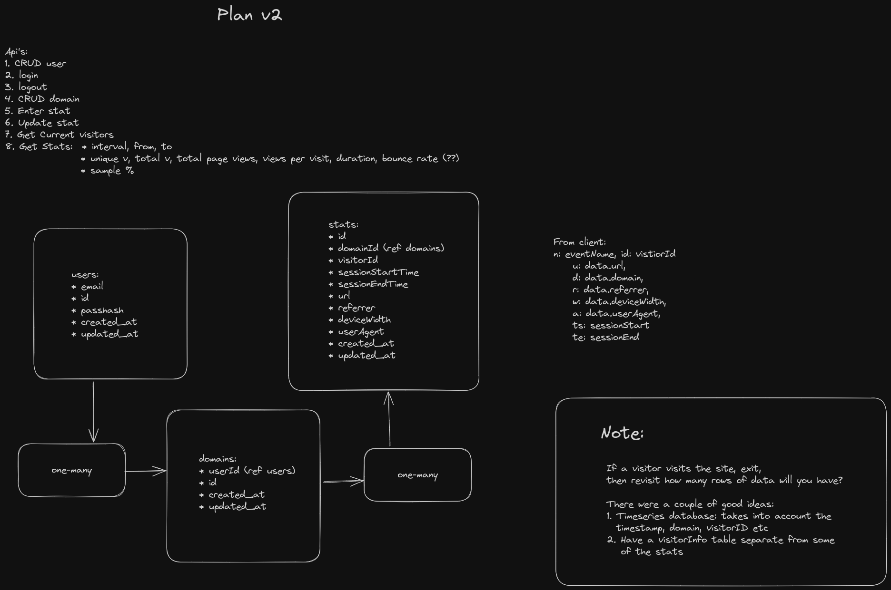

# Server

Now that the client is able to send the payload neccessary from the domain being 
analyzed. It's time to start working on the server. Haven't designed database tables 
in a long time and I'm definetly rusty.

## Plan v1

## Getting help

Before I get started on the work, I'm trying to get the plan checked by a few people 
on Discord. They definitely know what they are doing and have done this kind of stuff 
before. You know building things. Although, it'll be a while before I can get any form 
of feedback (time difference) so I'm going to do some setup in the meantime.

Asking others to look into the plan was a great idea. There were some interesting questions 
raised. Which I would have totally missed. The plan remains largely the same with minor updates 
to the tables. Although, I've added notes on the areas of concern.

## Plan v2

