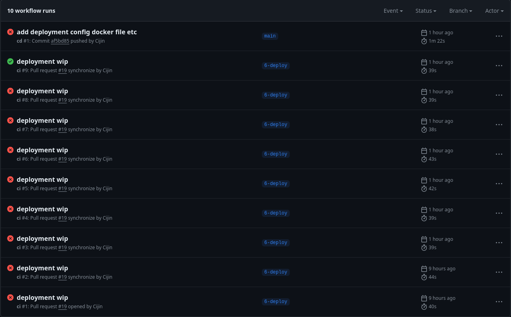

# The not so fun stuff

The procrastination has caught up, I've been putting this off the deployment stuff 
to the end. This one is slightly different to my other projects so, had to figure a 
few things out. Had to change a few things. Sometimes when I'm editing `Dockerfiles`, I feel 
like a monkey on a typewriter trying to write to write the dictionary. It shows too.

It's nearly the end of the day, and I think I know what needs to be done to take this 
over the finish line. Once I finish, I'm archiving this `Dockerfile`.

Then I can tackle the rest of the mountain of the tasks. Wierdly enough, I'm still having fun. 
It's not like I don't understand how docker works, I think that is incredibly intuitive and 
not a lot of effort. For some reason writing `Dockerfiles` baffles me.

## Minor update

I've managed to get things working locally, so I'm taking that as a big win. I've still 
got some time so I think I'll do my best to get it running on the production server.
