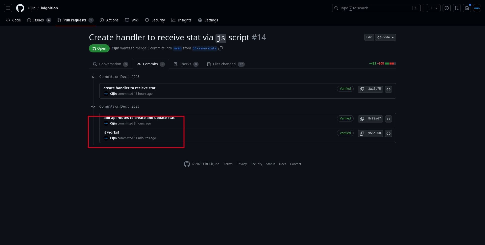

# It Works!

This will be a tiny update, as I'm feeling ecstatic. Nearly two weeks after my initial 
commit. I was able to get updates via the script to my server. The code is not very clean, 
in fact it's far from it. I'll be refactoring it slightly now, although I'm feeling amazing. 

## Not done yet

This was just a small celebration, although I'm far from finished. There is huge list 
of todo's in the [issues](https://github.com/Cijin/ioignition/issues). Even more, in comments 
to my PR's.

Although, I make sure I test my progress via observable output, seeing the core part of the analytics 
working is quite the thrill. This was just an idea two weeks ago, today it's an idea that kinda 
works. Finishing projects has been a challenge, but I was so pumped about the idea of me being able 
to get this working that I haven't been able to stop thinking about it.

## Finish line in sight

In terms of programming I can see the finish line, I'll take the rest of the week to polish, refactor 
and ensure it's super easy to use and try it out on pages of my own to see how it works.

Then once, that's done. I'll get the code looked over from a friends and other programmers. I hope to provide 
value to one more person at the least. At the very least, I'll never be paying for analytics again. That's good 
enough for me.
