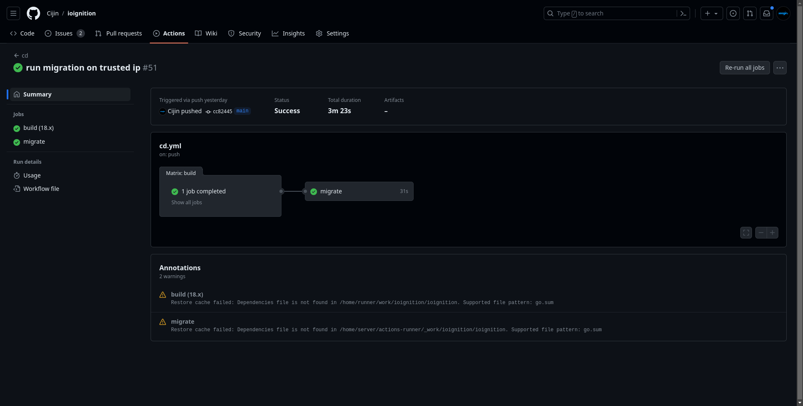

# More struggles: How not to setup your database

I'll be honest, this part was not easy. Also, this is also my biggest weakness in the whole process. Setting up production environments. 
I rely on docker to do as much of the work as possible, it's a life saver. Overall the last three to four days were spent questioning my 
choices on going down this path as a indie hacker to put it mildly. Things just refused to work, more like I did not understand why things
were not working. Skill issue, some would say.

## Setting up a server

I've done it enough times and rely on a script that I've written so that I don't mess things up. But, as always I mess with things that 
don't need messing. I "updated" the script cause I thought it was "better". Big mistake, updating things are usually fine but there's a 
time and a place for it. If it's the only thing I'm doing I have no problems re-writing entire configs and making things better. Why was 
it a bad idea? Cause I only wanted to run the app on a production environment and there are other things that I need to do on the app iteself 
to make it usable. I'd rather have people using a slightly slower app than have a blazingly fast app which will never see daylight.

Moving to a new config on it's own would not be a problem, cause if it's not working you tear down the server and start a new one with the 
old config. The problem was that enough time had passed between me setting up the server and me trying to deploy my app on it that I totally 
forgot about this. By the time I did remember it had be a couple of days.

Once I did remember, I destroyed the instance, started a new one switched to a more reliable script and just like that the server was working.

It was not all bad though, as a side effect to the server just not working, I realized that my Dockerfile was doing way more things than it 
needed to do. Things that the github action could do and I could get better responses to failures. So I updated the Dockerfile to essentials.

This was just struggle 1/25.

## Setting up the database

Server is building and working, now it needs to connect to the database. Should be easy right? It is, but for some reason all the straight forward 
solutions seemed to be eluding me the last couple of days. I use digitalocean for all my projects, and on the menu there is a link to managed databases. 
I swear, it's like it's existence got wiped from my memory. I use docker a lot and understand about using networks to restrict 
access etc and some more basic things. In my head it was pretty simple, spin up a service, add the url to this service as a secret and we are good to go.

Obviously not to be, as I couldn't figure out why the migrations for the database would not run, even with a self-hosted runner. As I'm writing this, I 
just understood why. I forgot to add the runner in the same network as the database. Anyhow. After spending half my Sunday on figuring this out among 
other things, managed databases popped back into my memory, from there it was done in about 15 minutes.

Although, it was the struggle that helped me realize a few things about my config, where to find them and see if things work. So there's that.

## Takeaway

Surprisingly enough, not once did it cross my mind over the last few days if I wanted to carry on, or why? or if I should quit? I realized early on 
that I'm getting annoyed or frustrated because I'm expecting the current step to be the final one and that it should just work. Once, I had that 
realization, everytime I made a change or a fix I stopped expecting it to be complete. Once I did that, I was free to explore ways that I "knew" were 
not right.

This is what learning looks like, you find a lot of ways that don't work. This helps form opinions and understanding of why w is better than y under condition z.
Also why I think tutorials don't work, they skip this step. This step is different for all of us. 
Why? We have our own assumptions and ways of making sense of the world around us. We bring those assumptions to programming. 

Also, why I think it's misleading when you see videos on youtube saying, learn go in 20 minutes, or learn programming in 4 weeks. A, you never stop learning, kinda why I
love programming. B, you need time to learn and make mistakes, lots of it. Anyone who says you can be a programmer in less than a year is probably lying. This whole 
fiasco my reminder of the same, even after 4 years of programming professionally.

