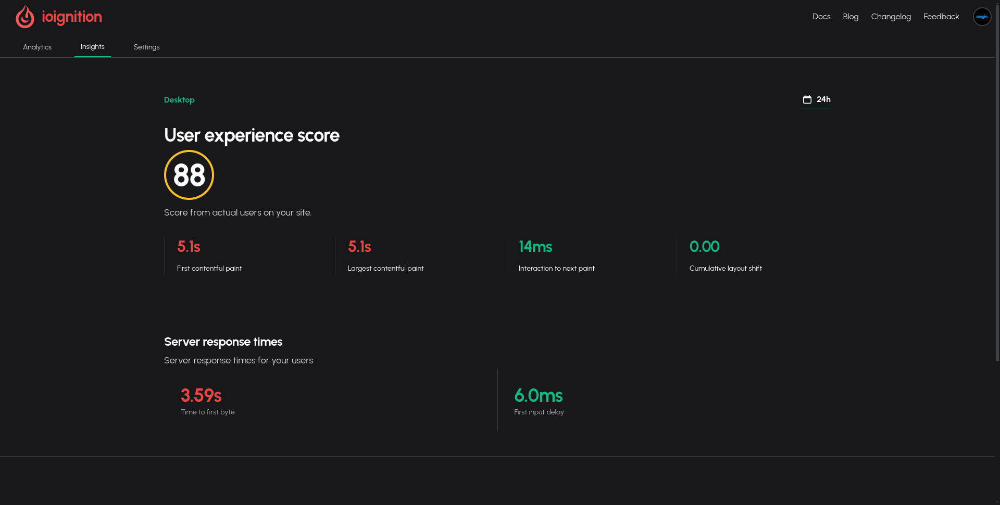
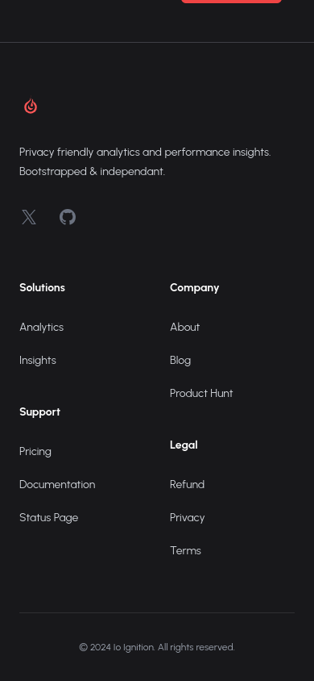

# What have I been up to last week?

* [Got performance insights working](#performance-section)
* [Improved the mobile responsiveness](#mobile)
* [Added documentation](#docs)

## Got performance insights working

Got performance insights working, it involved understanding some math, which I haven't done in over a decade. It is quite interesting though, how the scores are calculated. I will be writing about in detail in the documentation, where it might make more sense.

This was really fun to work on, I understood how with the smallest of metrics I was able to get a score that would make sense of page performance for real time users on your page. By using the right math.

## Improved the mobile responsiveness

Updated the `Nav` and the `Footer` on the page to be more mobile friendly and also to include the useful links required to navigate sections on the page like analytics and insights when you are within the site dashboard.

It was not the most fun thing to work on but the end results look quite good, even if I say so myself. Also, was able to replace a lot of the scripts with [AlpineJs](https://alpinejs.dev/_), which I'm absolutely enjoying at the moment to handle page interactions.

## Added documentation

I've setup the docs page using [docusaurus](https://docusaurus.io/), it was much needed. Especially as I added the performance insights feature, I realized I need a space where I can explain in detail what the metrics mean and how the scores are calculated. It took me a lot of reading from various sources to understand myself, so I can use this space to consolidate the useful details.

Even without having to explain things, I realized it might not be easy for people who are new to the site to be able to find out how to perform certain actions, hope this will help alleviate that pain.
