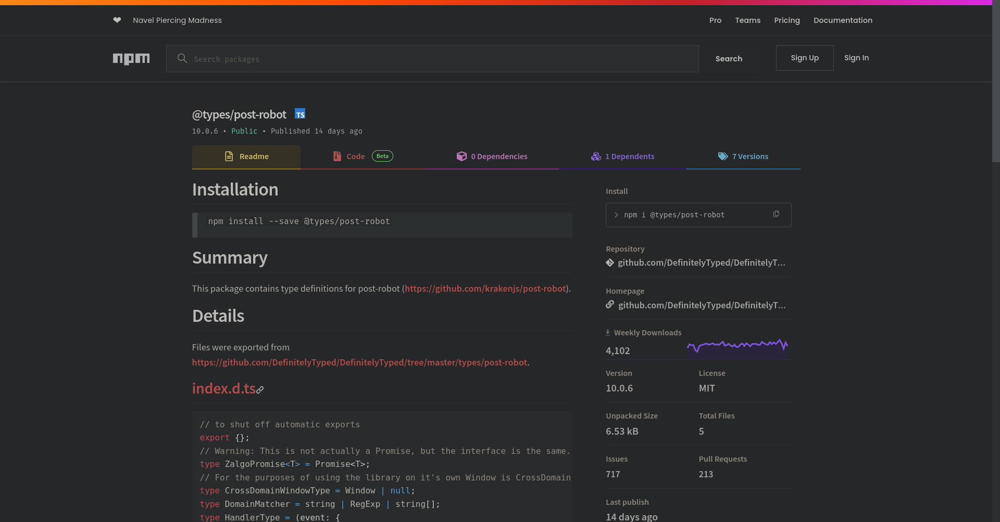

# @types/post-robot

Type definitions for the [post-robot](https://github.com/krakenjs/post-robot) repo. I currently still actively maintain
the [type definitions](https://www.npmjs.com/package/@types/post-robot). Although, it is very minimal overhead as the 
post-robot repository does not need to be updated often.

It's a very cool cross domain post messaging tool. It's created and used by Paypal in their "Pay with PayPal" button 
and they use post-robot to securely communicate with an iframe.

