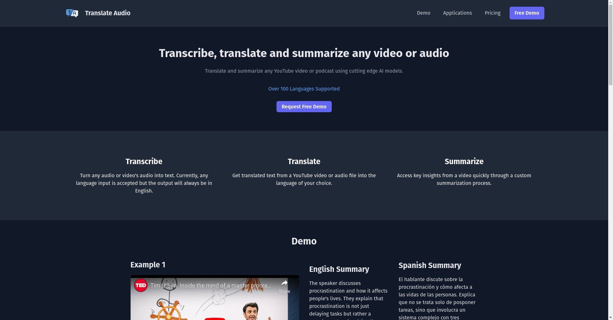

# Translate Audio: Summarize, Translate & Transcribe Audio

Translate and summarize any YouTube video or podcast using cutting edge AI models. With over 100 
languages supported.

This was an attempt to try out some of the AI models and see what could be done by 
making a couple of them work togehter into producing a result that is useful.

These were the following features:

### Transcribe

Turn any audio or video's audio into text. Currently, any language input is accepted but the output will always be in English.

### Translate

Get translated text from a YouTube video or audio file into the language of your choice.

### Summarize

Access key insights from a video quickly through a custom summarization process.

You can find the project here: [translateaudio.co](https://translateaudio.co/)

